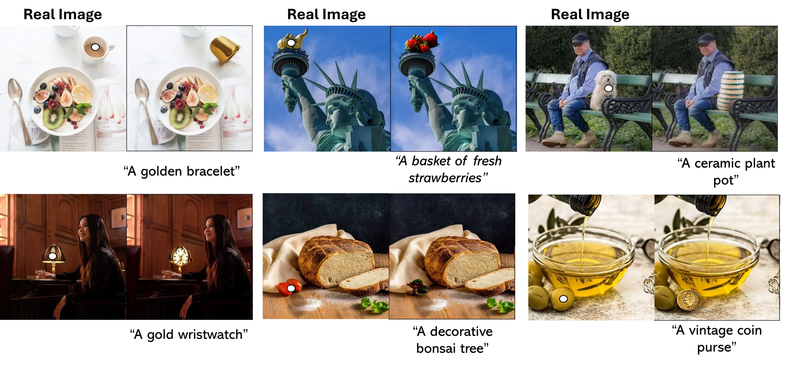

# FocusDiff

**Toward 360-Degree Indoor Panorama Editing via Tuning-Free Diffusion Model with Refocusing Cross-Attention**

[](https://vdkhoi20.github.io/FocusDiff/)
[](https://github.com/vdkhoi20/FocusDiff)
[](https://github.com/vdkhoi20/FocusDiff/tree/main/LIMB)
[](#)

**Accepted to ICCCI 2026**

FocusDiff is a tuning-free localized image editing framework for precise region-specific manipulation. It refocuses diffusion attention on the user-selected target by selectively blurring non-editing areas, then transfers object identity, structure, and appearance back to the edited image while preserving the surrounding context.

<p align="center">
  
</p>

## Highlights

- Tuning-free localized text-guided editing with frozen diffusion models.
- Refocusing Cross-Attention for small or cluttered target objects.
- Context-Preserving Integration for stable backgrounds and reduced spillover.
- Shared API for Stable Diffusion 1.5, Stable Diffusion 2.1, and SDXL.
- 360-degree indoor panorama editing workflow for VR environments.
- LIMB benchmark with 30 multi-object images and 100 localized annotations.

## Project Page

The academic project page is available at:

https://vdkhoi20.github.io/FocusDiff/

The page source is the static `index.html` in this repository and uses the paper assets in `Images_in_Paper/`.

## Installation

```bash
git clone https://github.com/vdkhoi20/FocusDiff.git
cd FocusDiff
pip install -r requirements.txt
```

## Usage

Run a single image edit:

```bash
python run_focusdiff.py \
  --version sd21 \
  --image LIMB/Images/23.jpg \
  --mask LIMB/Masks/23.jpg \
  --prompt "a decorative lantern" \
  --output results/focusdiff_sd21.png
```

Available backbones:

```bash
python run_focusdiff.py --version sd15
python run_focusdiff.py --version sd21
python run_focusdiff.py --version sdxl
```

Run on the LIMB dataset:

```bash
python run_focusdiff.py \
  --version sd15 \
  --dataset LIMB \
  --output results
```

The dataset runner expects `annotates.json`, `Images/`, and `Masks/`. Each annotation should contain `img_name` and either `prompt` or `target_text`.

## Quantitative Results

| Method | CLIPScore ↑ | LPIPS ↓ |
| --- | ---: | ---: |
| MasaCtrl | 20.12 | 0.280 |
| Blended-Diffusion | 27.43 | 0.156 |
| DiffEdit | 27.75 | 0.148 |
| LEDITS++ | 32.76 | 0.103 |
| CPAM | 33.45 | 0.101 |
| **FocusDiff-SD1.5** | **35.85** | **0.099** |
| **FocusDiff-SD2.1** | **35.61** | **0.068** |
| **FocusDiff-SDXL** | **36.48** | **0.064** |

## LIMB Benchmark

LIMB is a localized image manipulation benchmark curated from PIE-Bench for fine-grained region-specific editing. It contains 30 multi-object images and 100 localized editing annotations, including challenging small-object cases.

## Related Projects

- [FocusDiff Project Page](https://vdkhoi20.github.io/FocusDiff/)
- [PANDORA: Zero-Shot Object Removal](https://vdkhoi20.github.io/PANDORA/)
- [CPAM: Context-Preserving Adaptive Manipulation](https://vdkhoi20.github.io/CPAM/)
- iCONTRA: Toward Thematic Collection Design Via Interactive Concept Transfer
- EPEdit: Redefining Image Editing with Generative AI and User-Centric Design

```bibtex
@inproceedings{Vo2026ICME,
  title = {PANDORA: Pixel-wise Attention Dissolution and Latent Guidance for Zero-Shot Object Removal},
  author = {Vo, Dinh-Khoi and Nguyen, Van-Loc and Nguyen, Tam V. and Tran, Minh-Triet and Le, Trung-Nghia},
  booktitle = {IEEE International Conference on Multimedia and Expo (ICME)},
  year = {2026},
}

@inproceedings{Vo2026DemoICME,
  title = {Zero-Shot Mass-Similar and Multi-Object Removal in Single Pass},
  author = {Dinh-Khoi Vo and Van-Loc Nguyen and Tam V. Nguyen and Minh-Triet Tran and Trung-Nghia Le},
  booktitle = {IEEE International Conference on Multimedia and Expo (ICME)},
  year = {2026},
}

@article{vo2026cpam,
  title = {CPAM: Context-Preserving Adaptive Manipulation for Zero-Shot Real Image Editing},
  author = {Vo, Dinh-Khoi and Do, Thanh-Toan and Nguyen, Tam V. and Tran, Minh-Triet and Le, Trung-Nghia},
  journal = {IEEE Transactions on Multimedia},
  year = {2026},
  url = {https://arxiv.org/abs/2506.18438},
  code = {https://github.com/vdkhoi20/CPAM}
}

@inproceedings{vo2024icontra,
  title = {iCONTRA: Toward Thematic Collection Design Via Interactive Concept Transfer},
  author = {Vo, Dinh-Khoi and Ly, Duy-Nam and Le, Khanh-Duy and Nguyen, Tam V. and Tran, Minh-Triet and Le, Trung-Nghia},
  booktitle = {Extended Abstracts of the CHI Conference on Human Factors in Computing Systems},
  year = {2024}
}

@inproceedings{nguyen2024epedit,
  title = {EPEdit: Redefining Image Editing with Generative AI and User-Centric Design},
  author = {Nguyen, Hoang-Phuc and Vo, Dinh-Khoi and Do, Trong-Le and Nguyen, Hai-Dang and Nguyen, Tan-Cong and Nguyen, Vinh-Tiep and Nguyen, Tam V. and Le, Khanh-Duy and Tran, Minh-Triet and Le, Trung-Nghia},
  booktitle = {International Symposium on Information and Communication Technology},
  year = {2024}
}
```

## BibTeX

```bibtex
@inproceedings{vo2026focusdiff,
  title = {Toward 360-Degree Indoor Panorama Editing via Tuning-Free Diffusion Model with Refocusing Cross-Attention},
  author = {Vo, Dinh-Khoi and Le-Hinh, Nhut-Thanh and Huynh, Viet-Tham and Nguyen, Tam V. and Tran, Minh-Triet and Le, Trung-Nghia},
  booktitle = {International Conference on Computational Collective Intelligence},
  year = {2026}
}
```
